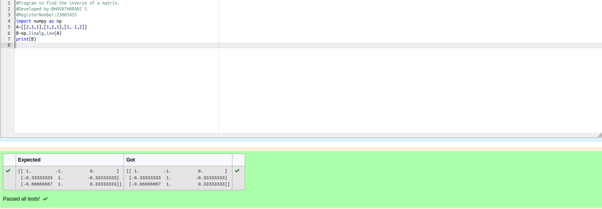

# INVERSE-OF-A-MATRIX
## Aim:
To write a python program to find the inverse of a matrix
## Equipment’s required:
1. 	Hardware – PCs
2. 	Anaconda – Python 3.7 Installation / Moodle-Code Runner
## Algorithm:
### Step1 : 
Augument the matrix
### Step 2: 
Substitue using Gaussian Elimination method
### Step 3: 
Use back substitution to convert into a row echolen form
### Step 4:
Extract the inverse 
### Step 5:
Run the program
## Program:
```
#Program to find the inverse of a matrix.
#Developed by:BHAVATHARANI S 
#RegisterNumber:23005455
import numpy as np
A=[[2,1,1],[1,1,1],[1,-1,2]]
B=np.linalg.inv(A)
print(B)
```

## Output:

## Result:
Thus the inverse of given matrix is successfully solved using python program

